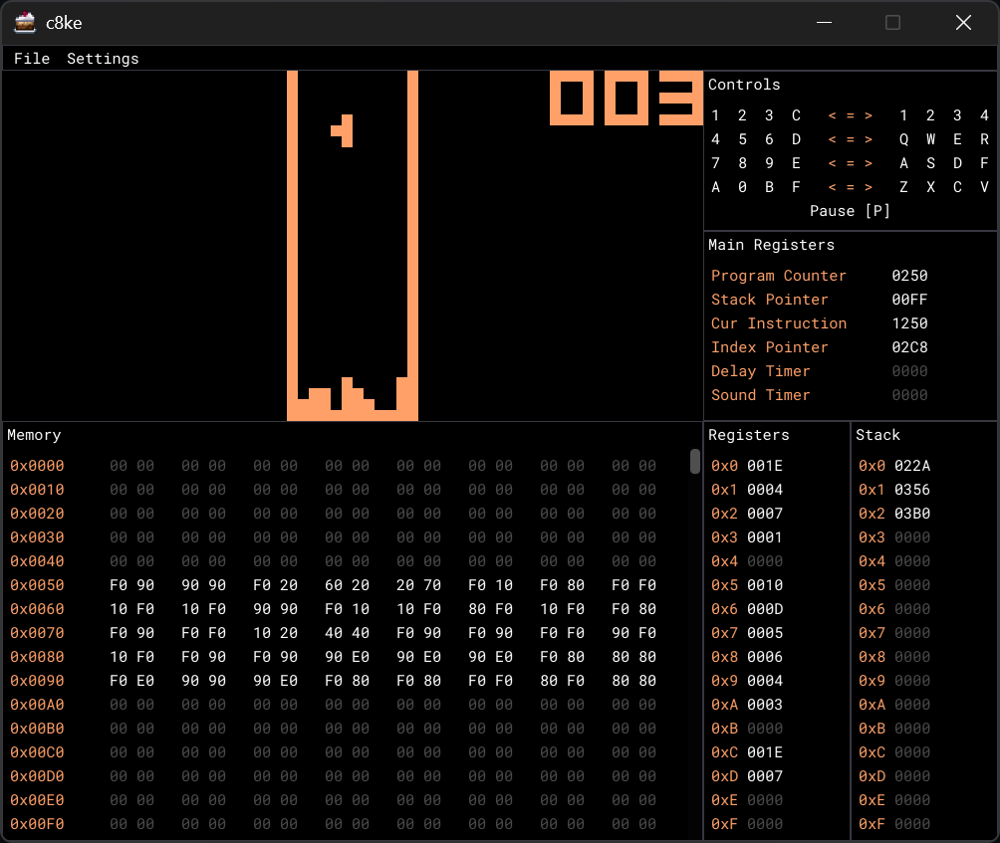

# c8ke

An emulator for the CHIP-8 interpreted language written in C++. For more information: [CHIP-8 - Wikipedia](https://en.wikipedia.org/wiki/CHIP-8)



## Getting Started

To get the project and vcpkg submodule:

```bash
git clone --recursive https://github.com/dadams05/c8ke.git
```

If you already cloned without the submodule, or need to get the submodule again, get it with:

```bash
git submodule update --init --recursive
```

### Bootstrap vcpkg

If there’s no `vcpkg.exe` in the `vcpkg/` folder, you need to bootstrap vcpkg so the tool builds itself:

```bash
cd vcpkg
bootstrap-vcpkg.bat
```

### Configure and build

**Visual Studio:**

- This project was originally developed in Visual Studio so the included `CMakePresets.json` already sets the appropriate toolchain flags.
- Just select the desired preset (e.g. _x64 Debug_) and CMake will handle dependency installation and building automatically.

**Other environments:**

If you’re unable to use the included `CMakePresets.json`, you must tell CMake to use the vcpkg toolchain so it installs and links dependencies correctly:

```bash
cmake -S . -B build -DCMAKE_TOOLCHAIN_FILE=vcpkg/scripts/buildsystems/vcpkg.cmake
cmake --build build
```

## Features

- Accurate CHIP-8 emulation (timing, sound, instructions)
- Customizable colors for screen and debugger (via ImGui)
- Built-in debugger:
  - Registers, stack, memory viewer
  - Key mapping display
- ROM loader with file dialog support (`.ch8`)
- Beep audio tuning (amount & phase)
- Pause/resume support

## ROMs

There are no ROMs included in this repo, but you can find some here:

- [ROMs for testing the emulator](https://github.com/Timendus/chip8-test-suite)
- [Games and demos](https://github.com/kripod/chip8-roms)

## Credits

- [SDL3](https://github.com/libsdl-org/SDL)
- [Dear ImGui](https://github.com/ocornut/imgui)
- [tinyfiledialogs](https://sourceforge.net/projects/tinyfiledialogs/)
- [Google Fonts - Roboto Mono](https://fonts.google.com/specimen/Roboto+Mono)
- [Terraria](https://terraria.org/) (for the cake icon)
